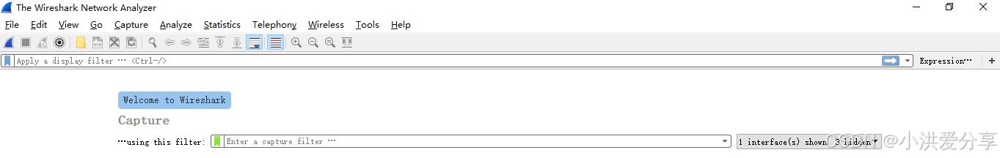
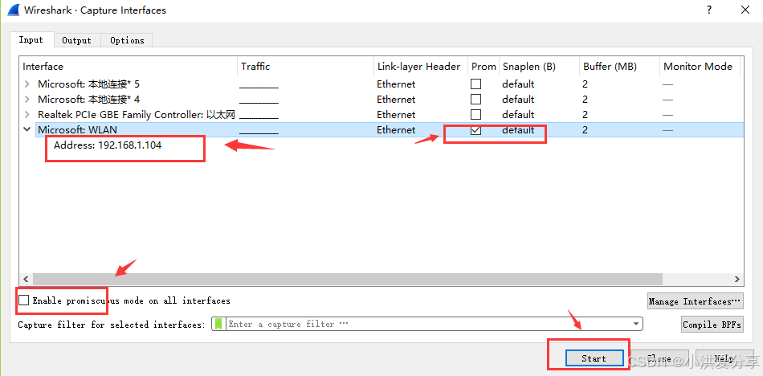
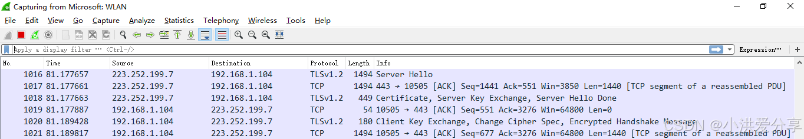
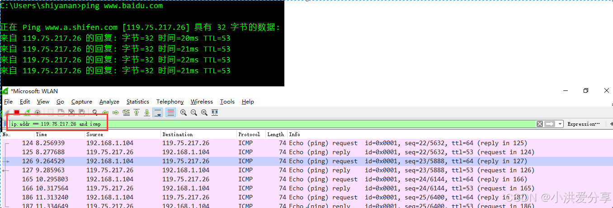

git init

git add README.md

git commit -m "first commit"

git branch -M main

git remote add origin [https://github.com/lin20021212/Money.git](https://github.com/lin20021212/SmartCamara.git)

git push -u origin main

### 1. **从远程仓库拉取最新代码**

在本地仓库中，执行以下命令从远程仓库拉取最新的代码并合并到当前分支：

git pull origin main

* `origin` 是远程仓库的名称（默认是 `origin`）。
* `main` 是你要同步的分支名称。

`git pull` 会自动从远程仓库获取代码并尝试与本地分支合并。如果存在冲突，需要手动解决。

### 2. **查看本地与远程的差异**

如果你只想查看本地与远程仓库的差异，可以使用以下命令：

git diff origin/main

这会显示本地分支与远程分支之间的差异。

### 3. **解决冲突**

如果 `git pull` 时出现冲突（例如本地修改与远程修改冲突），需要手动解决：

1. 打开冲突的文件，找到冲突标记（`<<<<<<<` 和 `>>>>>>>`）。
2. 选择保留的代码，删除冲突标记。
3. 解决冲突后，添加修改的文件：git add <文件名>
4. 提交修改：git commit -m "解决冲突并合并代码"

### 4. **强制同步（覆盖本地修改）**

如果你希望放弃本地修改，直接从远程仓库同步最新代码，可以使用以下命令：

git fetch origin
git reset --hard origin/main

* `git fetch` 会从远程仓库获取最新的代码，但不会自动合并。
* `git reset --hard` 会将本地分支强制重置为远程分支的状态，放弃所有本地修改。

**注意：** 使用 `git reset --hard` 会丢失未提交的本地修改，请确保所有重要修改已经提交。

养成定期同步的习惯，尤其是在团队协作中：

5. **定期同步**

* 每次开始工作前，先执行 `git pull` 拉取最新代码。
* 完成修改后，提交并推送：git add .
  git commit -m "提交信息"
  git push origin main

Wireshark抓包新手使用教程

Wireshark是非常流行的网络封包分析软件，可以截取各种网络数据包，并显示数据包详细信息。常用于开发测试过程各种问题定位。本文主要内容包括：

    1、Wireshark软件下载和安装以及Wireshark主界面介绍。

    2、WireShark简单抓包示例。通过该例子学会怎么抓包以及如何简单查看分析数据包内容。

    3、Wireshark过滤器使用。过滤器包含两种类型，一种是抓包过滤器，就是抓取前设置过滤规则。另外一种是显示过滤器，就是在数据包分析时进行过滤数据使用。通过过滤器可以筛选出想要分析的内容。包括按照协议过滤、端口和主机名过滤、数据包内容过滤。具体规则和实例可以查看正文。

目录

Wireshark软件安装

Wireshark 开始抓包示例

Wireshakr抓包界面介绍

Wireshark过滤器设置

Wireshark抓包分析TCP三次握手

Wireshark分析常用操作

Wireshark软件安装
软件下载路径：

Wireshark官网下载地址
https://www.wireshark.org/download.html
按照系统版本选择下载，下载完成后，按照软件提示一路Next安装。

说明：如果你是Win10系统，安装完成后，选择抓包但是不显示网卡，下载win10pcap兼容性安装包。下载路径：

win10pcap兼容性安装包

Wireshark 开始抓包示例
先介绍一个使用wireshark工具抓取ping命令操作的示例，让读者可以先上手操作感受一下抓包的具体过程。

1、打开wireshark，主界面如下：

2、选择菜单栏上Capture -> Option，勾选WLAN网卡（这里需要根据各自电脑网卡使用情况选择，简单的办法可以看使用的IP对应的网卡）。点击Start。启动抓包。

**3、wireshark启动后，wireshark处于抓包状态中。**

4、执行需要抓包的操作，如在cmd窗口下执行ping www.baidu.com。

5、操作完成后相关数据包就抓取到了。为避免其他无用的数据包影响分析，可以通过在过滤栏设置过滤条件进行数据包列表过滤，获取结果如下。

说明：ip.addr == 119.75.217.26 and icmp 表示只显示ICPM协议且源主机IP或者目的主机IP为119.75.217.26的数据包。协议名称icmp要小写。

**6、wireshark抓包完成，就这么简单。关于wireshark显示过滤条件、抓包过滤条件、以及如何查看数据包中的详细内容在后面介绍。**

————————————————

    版权声明：本文为博主原创文章，遵循 CC 4.0 BY-SA 版权协议，转载请附上原文出处链接和本声明。

原文链接：https://blog.csdn.net/weixin_48916444/article/details/144283540
